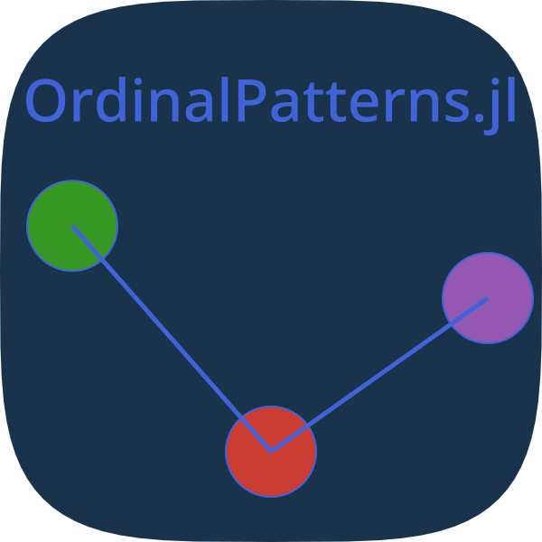

#  StatsOP.jl 

This Julia package provides functions to conduct (sequential) tests for time series data, using ordinal patterns. The package builds on the seminal work of Bandt and Pompe (2002). It is designed to be easy to use and provides a simple interface to compute ordinal patterns from time series data. However, it is still work in progress and not registered with the Julia package registry. In addition, the API is subject to change. 

Previously, the name of the package was **OrdinalPatterns.jl**, but it has been renamed to better reflect its purpose.  

## Documentation
The documentation for the package can be found [here](https://adaemmerp.github.io/StatsOP.jl/).
